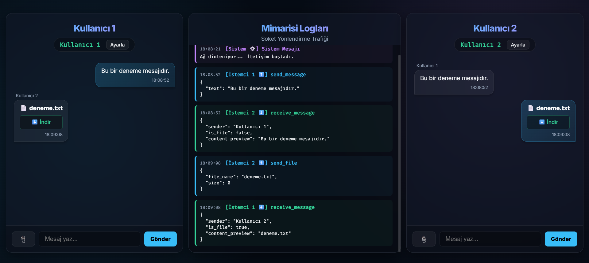

# Soket Mimarisi Laboratuvarı: Çift İstemcili Chat Uygulaması

Bu proje, soket programlama mimarisini ve iletişim akışını görselleştirmeyi amaçlayan, **Flask** ve **Socket.IO** ile geliştirilmiş gerçek zamanlı bir eğitim uygulamasıdır.

## 📌 Proje Amacı ve Kapsamı
Bu uygulama bir ödev/laboratuvar projesi olarak geliştirilmiştir. Temel amacı:
- Geleneksel istek-cevap (request-response) döngüsü yerine **gerçek zamanlı (real-time)** soket bağlantılarının nasıl çalıştığını,
- Sunucu ve birden fazla istemci (client) arasındaki mesaj yayınlama (broadcasting) mantığını,
- Sistem logları üzerinden soket yönlendirme trafiğini pratik ve görsel bir biçimde göstermektir.

## 🖼️ Ekran Görüntüsü
> Uygulama arayüzünden bir görünüm:


*(Not: Öğretim görevlisinin incelemesi için uygulamanın çalışan halini gösteren temsili ekran görüntüsü hedeflenmiştir.)*

## 🚀 Özellikler
- **Çift İstemci Desteği (Dual Client):** Aynı ekran üzerinde iki farklı istemci penceresi (Kullanıcı 1 ve Kullanıcı 2).
- **Gerçek Zamanlı İletişim:** İletilen mesajlar WebSockets aracılığıyla anında diğer istemciye ulaşır.
- **Soket Trafiği Gözlem (Log) Paneli:** Ortada bulunan log paneli ile bağlanan kullanıcılar ve soketler arası veri transferi "Mimarisi Logları" olarak izlenebilir.
- **Dosya Transferi:** Base64 kodlaması üzerinden soket ile dosya/resim gönderimi desteği eklendi.
- **Dinamik Kullanıcı İsimlendirme:** İstemciler bağlanırken varsayılan atanan kendi adlarını "Ayarla" butonuyla değiştirebilir.

## 🛠️ Kurulum ve Çalıştırma
Projeyi lokalinizde test etmek ve çalıştırmak için aşağıdaki adımları izleyin:

### 1. Ön Koşullar
Bilgisayarınızda **Python 3.x** yüklü olmalıdır.

### 2. Kurulum
Terminali açın ve gerekli kütüphaneleri projenin ana dizininde yükleyin:
```bash
pip install flask flask-socketio eventlet
```
*(Not: eventlet, Socket.IO'nun daha performanslı, asenkron çalışabilmesi için kullanılan opsiyonel ama önerilen bir kütüphanedir.)*

### 3. Uygulamayı Başlatma
Projenin ana dizininde aşağıdaki komutu çalıştırarak Flask sunucusunu başlatın:
```bash
python app.py
```

### 4. Tarayıcıdan Erişim
Terminalde sunucunun başladığı cihazı gördükten sonra, tarayıcınızı açın ve aşağıdaki adrese gidin:
```text
http://127.0.0.1:5000
```
*(veya http://localhost:5000)*

## 💻 Kullanılan Teknolojiler
- **Backend:** Python, Flask, Flask-SocketIO
- **Frontend:** HTML5, Vanilla CSS (Glassmorphism), JavaScript, Socket.IO Client (v4.7.2)
- **Mimari:** Client-Server Modeli, Olay Güdümlü (Event-Driven) İletişim
- **Tasarım Deseni:** Çift istemci simülasyonu için tek ekranda izole edilmiş DOM yapıları

---
**Geliştirici:** İlhan Demirel & Soket Mimari Ekibi
